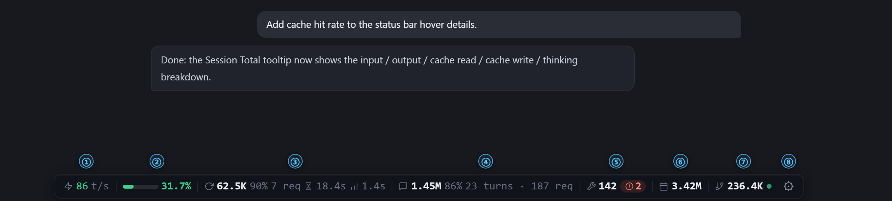
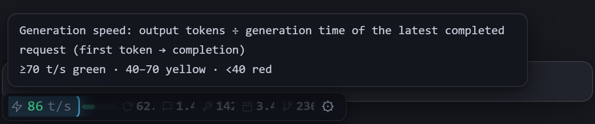
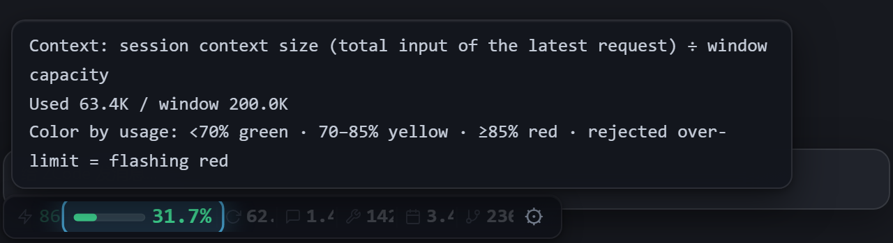
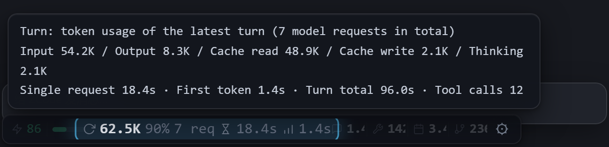
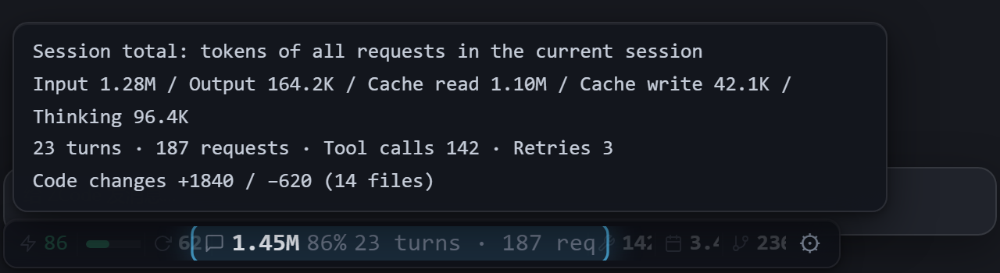
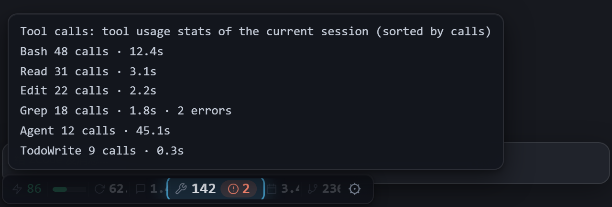
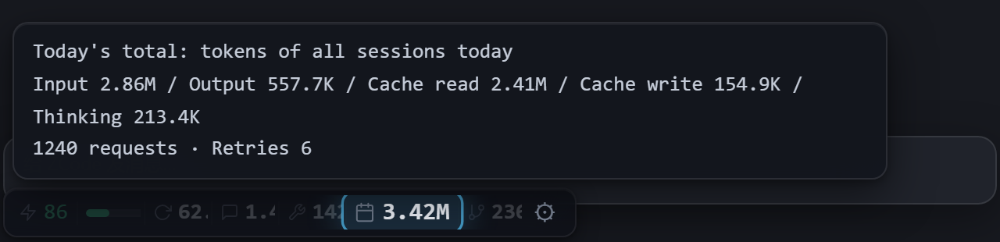
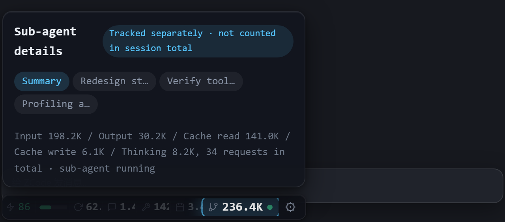
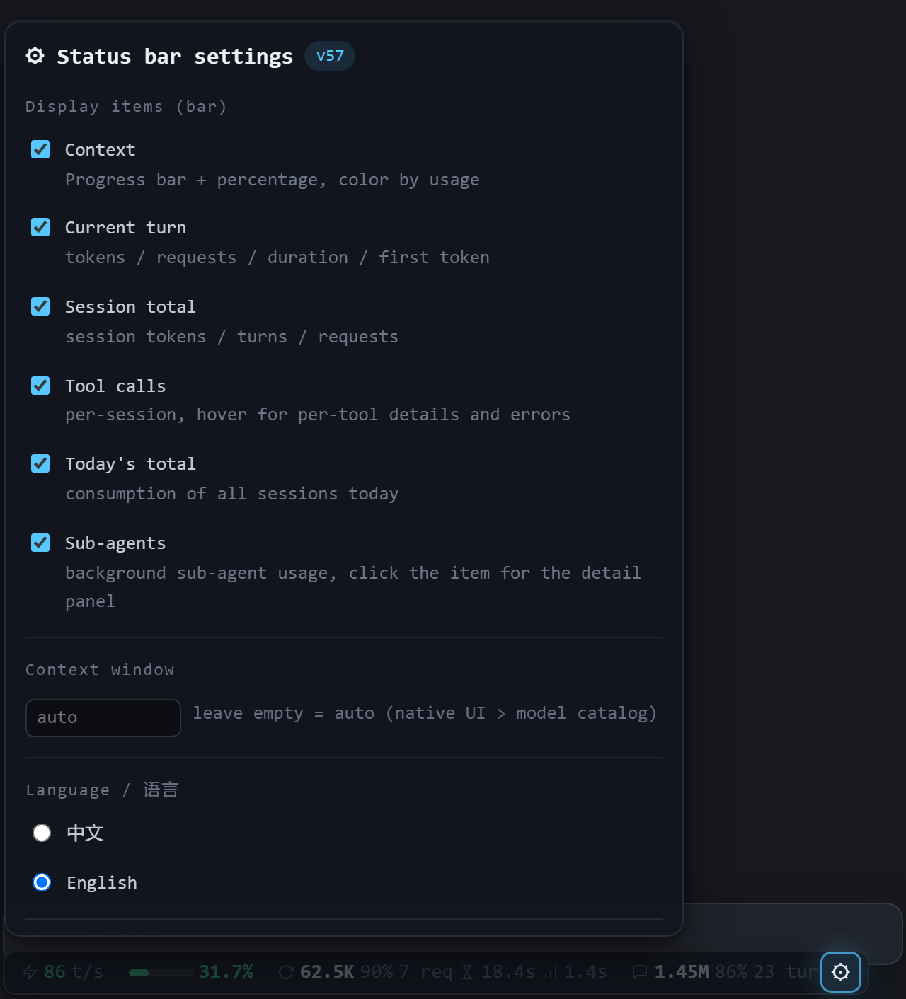

# ZCode Token Usage Status Bar

[中文](README.zh-CN.md) | English

A floating status bar for the [ZCode](https://zcode.ai) desktop client (Electron app) that shows real-time token usage of the current conversation window. It only reads the local SQLite database — never touches the network.

> This page is a condensed English overview. The in-depth docs in this repo are in Chinese.



## Features

The status bar floats at the bottom of the ZCode window and shows real-time token usage and runtime state of the current window. All items below can be toggled in the ⚙ panel.

### ① Generation Speed



Tokens per second of the most recent completed request (output tokens ÷ generation time, from first token to completion), color-coded in three tiers: ≥70 green, 40–70 yellow, <40 red — how fast the model is right now, at a glance.

### ② Context Capacity



A mini progress bar plus percentage showing how much of the context window the current session uses (total input of the latest request ÷ window capacity). The color shifts green → yellow → red as usage grows; large (≥1M tokens) windows warn earlier at 40%/60%. When a request is rejected for exceeding the window, the bar flashes red and a popup bubble offers three suggestions (roll back the previous turn / continue with a larger-window model or compress the session / start a new conversation). The window size is detected automatically: native ZCode UI (server-driven, follows the model) → built-in model catalog → `config.json` fallback — or override it manually in the ⚙ panel.

### ③ Current Turn



Token consumption of the latest turn, plus cache hit rate, model request count, single-request duration and first-token latency. Hover for the full breakdown: input / output / cache read / cache write / thinking, along with total turn duration and tool call count.

### ④ Session Total



Total consumption of all requests in the current session, with turn/request counts; code changes (+added / −removed lines and file count) are part of this item's details. Each conversation window shows only its own data — multiple windows never mix. Hover for the five-way breakdown.

### ⑤ Tool Calls



Total tool invocations in the session; a red badge lights up when errors occur. Hover for per-tool call counts, durations and error details.

### ⑥ Today's Total



Token consumption across all of today's sessions, aggregated across conversations and recalculated as each request completes.

### ⑦ Sub-agents



Token usage of background sub-agents in the current session, tracked separately from the session total; a blue ● means one is running right now. Hover shows a summary; clicking opens a fixed detail panel with tabs for the summary and each sub-agent's dispatch task name plus its input/output/cache/thinking breakdown.

### ⑧ Settings Panel



Click ⚙ to toggle any bar item, override the context window size, or switch the UI language (中文 / English) — the change applies immediately and persists. Hovering any bar item also shows a detail tooltip (view-only); interactive content — like sub-agent details — opens in click-triggered fixed panels instead.

### More

- **Automatic context-window detection**: native ZCode UI → model catalog → `config.json` fallback.
- **Session tracking**: each window shows only the data of its own focused session — zero cross-window bleed.
- **MCP in-chat query**: `token_usage(scope)` supporting current / today / week / days:N / sessions:N / models:days / session:<id prefix>.
- **CLI**: `python zusage.py [now|today|json|days N|sessions [N]|models [days]|watch]`.
- **/usage command** in the chat input.

## Installation

Requirements: Windows; Python 3.8+ (zero third-party dependencies).

```bash
git clone https://github.com/xhwxt/zcode-token-usage-statusbar.git
cd zcode-token-usage-statusbar
python install.py            # add --lang en for English installer/CLI/MCP output
```

One command does it all: locate the ZCode installation → copy the runtime into the data directory `~/.zcode/zcode-token-usage-statusbar/` → migrate/generate config.json → patch app.asar (a single loader line) → register the MCP server → install the /usage command → open an install-monitor window that reminds you to restart ZCode and confirms the injection took effect.

**ZCode upgrades overwrite app.asar — just re-run `python install.py`.**

## Data Source

Reads `~/.zcode/cli/db/db.sqlite` (`model_usage` / `turn_usage` / `tool_usage` — one row per model request), strictly read-only, never online. Numbers refresh event-driven when a request completes; when idle there are zero extra processes and zero polling.

## Uninstall

```bash
python install.py --remove
```

## Notes

- Data semantics, performance measurements, diagnostics and pitfall notes (Chinese) live in [docs/design-notes.md](docs/design-notes.md).
- Patching app.asar is an unofficial injection route; ZCode updates overwrite it — re-run install after upgrading.
- License: [MIT](LICENSE).
