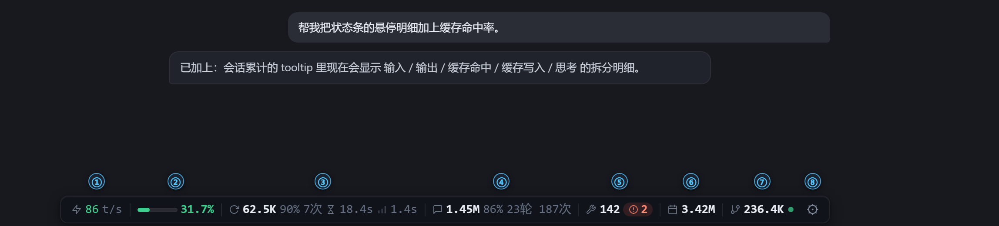
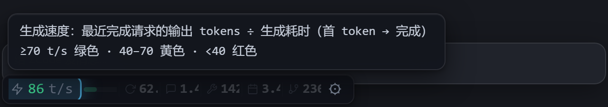
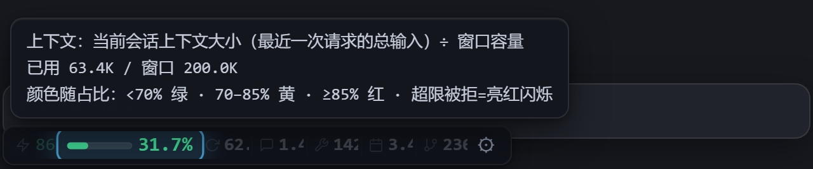
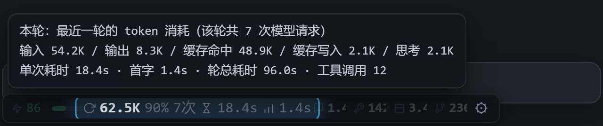
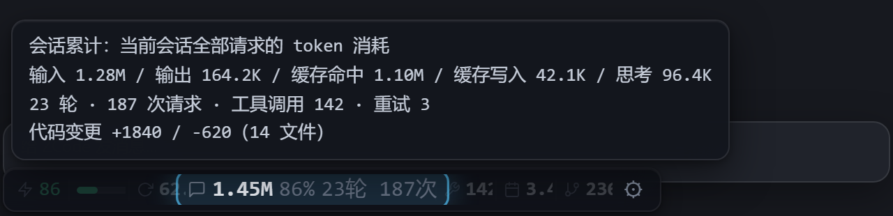
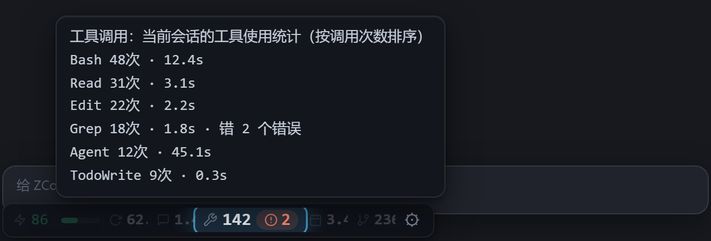
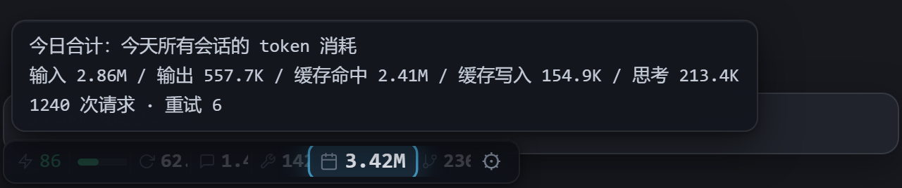
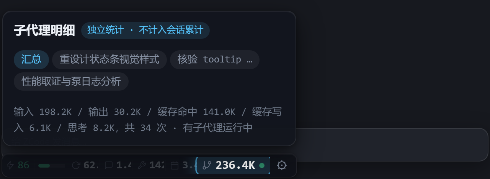
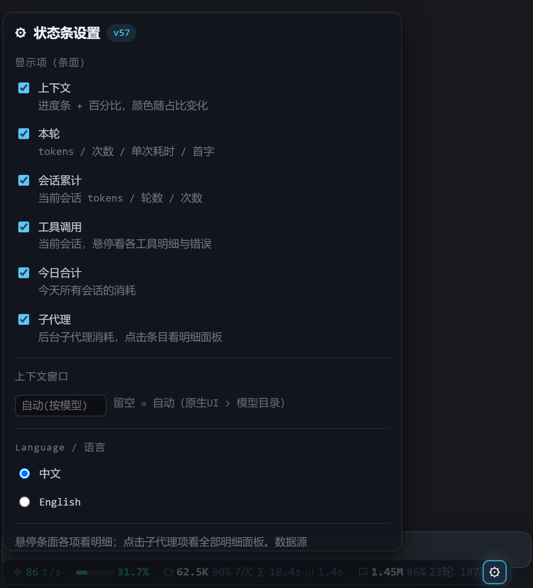

# ZCode Token 用量状态栏

[English](README.md) | 简体中文

给 [ZCode](https://zcode.ai) 桌面客户端（Electron 应用）加上一个悬浮的 token 用量状态条。数据源是本地 SQLite（`~/.zcode/cli/db/db.sqlite` 的 `model_usage` / `turn_usage` / `tool_usage` 表，每次模型请求一行），**全程只读、不联网**。

平台：Windows ｜ 许可：[MIT](LICENSE)

> 文档与界面统一使用中文名「ZCode Token 用量状态栏」；仓库与 MCP 注册名为 `zcode-token-usage-statusbar`（全称的英文写法），代码内部标识符为 `zusage`。

## 为什么是注入而不是插件？

ZCode 的插件机制（`plugin.json`）只能提供 MCP / skills / commands / hooks，**没有客户端 UI 能力**；状态条要画进主窗口，唯一路线是往 `app.asar` 主入口注入一行 loader。MCP 查询部分则是标准的插件级能力，一键安装会自动注册。

## 功能

状态条悬浮在 ZCode 对话窗口最底部，实时显示本窗口的 token 用量与运行状态——数据只读本地数据库（每次模型请求一行），全程不联网、零轮询。



### ① 生成速度



条面第一项显示最近一次完成请求的生成速度（输出 tokens ÷ 生成耗时，从首 token 到完成），按快慢三档变色：≥70 绿、40–70 黄、<40 红——当前模型快不快，一眼可读。每次请求完成落库后自动刷新。

### ② 上下文容量



微进度条 + 百分比显示当前会话的上下文占比（最近一次请求的总输入 ÷ 上下文窗口容量），颜色随占比从绿转黄再转红；百万级大窗口提前预警（40%/60% 档），其余窗口 70%/85% 档。请求因超出窗口容量被拒绝时，进度条亮红闪烁并弹出告警气泡，给出三条处置建议（回滚上一轮对话 / 换用上下文窗口更大的模型继续，或压缩精简本会话 / 新开会话）。窗口大小无需手动配置：优先读 ZCode 原生 UI（服务端下发、自动跟随模型）→ 模型目录查表 → `config.json` 兜底，也可以在 ⚙ 设置里手动覆盖。

### ③ 本轮



显示最近一轮对话（从你发消息到本轮完成）的 token 消耗、缓存命中率、模型请求次数、单次请求耗时与首字延迟。悬停可看完整拆分：输入 / 输出 / 缓存命中 / 缓存写入 / 思考，以及轮总耗时与工具调用次数。

### ④ 会话累计



当前会话全部请求的总消耗与轮次、请求次数统计；代码变更（+新增 / -删除行数与涉及文件数）也在这一项的明细里。每个对话窗口只显示它自己的数据（泵按窗口注入焦点会话），多窗口互不串显；悬停同样有 输入 / 输出 / 缓存命中 / 缓存写入 / 思考 的五项拆分。

### ⑤ 工具调用



当前会话的工具使用总次数；出现错误时右侧亮红色错误数徽标，工具是否稳定一目了然。悬停可看各工具的调用次数、耗时与错误明细。

### ⑥ 今日合计



今天所有会话的 token 总消耗，跨会话汇总、随每次请求完成实时重算，日用量一目了然。

### ⑦ 子代理



当前会话后台子代理的 token 消耗，独立统计、不计入会话累计；蓝色 ● 表示有子代理正在运行。悬停显示汇总，点击弹出固定明细面板——按页签切换汇总与各子代理，每个子代理显示派发任务名与输入/输出/缓存/思考明细。

### ⑧ 设置面板



点击 ⚙ 打开设置：各显示项独立开关、上下文窗口大小手动覆盖、界面语言切换（中文 / English，即时生效并记住选择）。悬停条面任意条目都会弹出明细 tooltip（纯查看），需要操作的内容（如子代理明细）则用点击弹出的固定面板，互不打架。

### 其它能力

- **上下文窗口自动识别**：优先读 ZCode 原生 UI（输入框工具行按钮文本"…总量 N"，服务端下发、自动跟随模型）→ 模型目录查表 → `config.json` 兜底。
- **会话跟随**：泵按窗口注入本窗口焦点会话 id（渲染端经客户端 IPC 通道上报），每个对话窗口只显示它自己的数据，池里没有就显示零值、绝不串显别的会话。
- **MCP 对话内查询**：`token_usage(scope)` 工具，scope 支持 current / today / week / days:N / sessions:N / models:days / session:<id前缀>。
- **CLI**：`python zusage.py [now|today|json|days N|sessions [N]|models [days]|watch [秒]]`。
- **/usage 命令**：对话输入框触发 MCP 查询。

## 文件说明

| 文件 | 作用 |
|---|---|
| `install.py` | **一键安装**：探测 ZCode 安装位置 → 复制运行时到数据目录 → 生成 config → 注入 asar → 注册 MCP → 装 /usage 命令 → 弹监控窗口。`--remove` 卸载，`--dry-run` 预览，`--no-mcp` 只装状态条，`--dev` 开发模式（不复制，注入直指本仓库目录）。 |
| `overlay.js` | 状态条本体（渲染进程注入，自包含 IIFE）。fixed 悬浮在**窗口最底部**（条下只留 3px 缝，给输入卡片加 margin-bottom 上移让位），rAF 每帧跟随；输入框定位要求 textarea 在视口下半部（排除设置页等处的输入元素）。 |
| `inject-main.cjs` | 主进程 loader：向每个窗口注入 overlay.js + **触发式监听 db 写入**（fs.watch db 目录，有写入→去抖 300ms→查询推送；空闲零进程零轮询，仅 30s 兜底心跳）。查询走**常驻 python**（`zusage.py serve` 行协议；意外退出自动重启、30s 内 3 次判不稳定回退一次性 spawn、zusage.py mtime 变化自动重启；stdin EOF 随泵退出自清理）。 |
| `patch_install.py` | asar 注入/卸载工具（install.py 的底层，可单独用）：备份 → 在入口 `out/main/index.js` 尾部追加 dynamic import 行 → 重打包 → 自检 → 原子替换。幂等，自动替换旧注入行（迁移友好）。安装成功自动弹出监控窗口。 |
| `install_monitor.py` | 安装监控窗口（常驻命令行，每 10 秒检测一次）：持续提醒重启 ZCode；重启后通过 diag 更新确认注入加载，显示成功并自动退出。运行中原子替换失败（生成 .tmp）时，它还会在 ZCode 退出后自动完成替换——**收尾不依赖计划任务**。 |
| `zusage.py` | 查询库 + CLI + 机器可读快照（`json` 子命令，状态条数据源）。 |
| `usage_mcp.py` | 零依赖 stdio MCP server。 |
| `config.example.json` | 运行配置模板（安装时生成到数据目录的 `config.json`；含本机路径，不入库）。 |

**数据目录 `~/.zcode/zcode-token-usage-statusbar/`** 是标准安装的运行目录：运行时副本（`inject-main.cjs`/`overlay.js`/`zusage.py`/`usage_mcp.py`）、`config.json`、诊断产物 `diag-<n>.json`（每窗口一份，主进程定期回写）都在这里。本仓库只是源码，**clone 目录可以随意搬走或删除，不影响已安装的实例**。

## 安装

前提：Windows；Python 3.8+（零第三方依赖）；fuses `EmbeddedAsarIntegrityValidation=0`（ZCode 当前版本实测为 0）。

```bash
git clone https://github.com/xhwxt/zcode-token-usage-statusbar.git
cd zcode-token-usage-statusbar
python install.py            # 加 --lang en 可让安装器/CLI/MCP 输出英文
```

一条命令完成：探测 ZCode 安装位置（找不到时询问，或 `--asar` 指定）→ **复制运行时到数据目录 `~/.zcode/zcode-token-usage-statusbar/`** → 迁移/生成 config.json → 注入 asar（注入行指向数据目录副本）→ 注册 MCP（server 名 `zcode-token-usage-statusbar`，指向数据目录副本）→ 安装 /usage 命令 → 弹出「安装监控」窗口（每 10 秒检测一次，提醒重启 ZCode；重启后检测到注入加载即显示成功并自动关闭；万一运行中原子替换失败，监控窗口会在你退出 ZCode 后自动完成替换）。

**ZCode 升级会覆盖 app.asar，重跑一次 `python install.py` 即可**（监控窗口提示"未检测到注入加载"通常就是这个原因）。

<details>
<summary>手动分步安装（等价于 install.py 做的事）</summary>

```bash
# 0) 数据目录：复制运行时 + 配置（改 python_path 为你的 python.exe 绝对路径）
mkdir -p ~/.zcode/zcode-token-usage-statusbar
cp inject-main.cjs overlay.js zusage.py usage_mcp.py ~/.zcode/zcode-token-usage-statusbar/
cp config.example.json ~/.zcode/zcode-token-usage-statusbar/config.json   # 然后编辑它

# 1) 状态条：注入 asar（注入行须指向数据目录的 inject-main.cjs；ZCode 运行中也可执行；
#    ZCode 不在 D:\ZCode 时先改脚本顶部 ASAR，或直接用 install.py）
python patch_install.py install

# 2) MCP：在 ~/.zcode/cli/config.json 的 mcp.servers 注册（指向数据目录副本）：
#   "zcode-token-usage-statusbar": { "command": "<python 绝对路径>", "args": ["<home>/.zcode/zcode-token-usage-statusbar/usage_mcp.py"] }

# 3) /usage 命令：把 usage.command.md 复制到 ~/.zcode/commands/usage.md
```

</details>

## 更新规则（重要）

改的是**仓库源码**，生效分两步：`git pull` 后重跑 `python install.py` 同步到数据目录副本，再按下表生效（注入行不变时 asar 不重打包，重跑是秒级）：

| 改了什么 | 生效方式 |
|---|---|
| `overlay.js` | 重跑 install.py 同步副本后，`hot_reload` 开着时 ~2 秒热更新，免重启（loader 检测副本 mtime，`new Function` 语法校验通过才注入，防载入写一半的文件）；`hot_reload: false` 关闭后改完需重启 |
| `zusage.py` | 重跑 install.py 同步副本后，泵检测到副本 mtime 变化即自动重启常驻 python（~2 秒生效）；一次性回退模式下仍是每次轮询新进程、下次轮询生效 |
| `config.json`（数据目录） | 下次拉取时生效（拉取由 db 写入触发；完全空闲时最迟一个兜底心跳，默认 30s） |
| `inject-main.cjs` 本身 / 首次安装 / 标准↔dev 互切 | 重跑 `python install.py` 后**需重启 ZCode**（注入行含绝对路径，脚本自动替换旧行） |

## 配置（config.json）

位置：标准安装在数据目录 `~/.zcode/zcode-token-usage-statusbar/config.json`（`--dev` 安装在仓库目录）。

```json
{
  "python_path": "python.exe 绝对路径",
  "activity_min_ms": 1500,  // 有 db 写入时的最小拉取间隔（活动期限频，到点自动补拉最后一笔）
  "heartbeat_ms": 30000,    // 兜底心跳：防 fs.watch 文件事件丢失；空闲时拉取只由此触发
  "resident": true,         // 常驻查询 python（zusage.py serve，省每次启动费 ~17MB 常驻内存）；false=回退一次性短进程
  "hot_reload": true,       // overlay.js 热更新开关（调试用）；false=改完需重启 ZCode
  "context_window": 1000000 // 上下文兜底值（原生读数/模型目录都失败时用）
}
```

## 数据口径、性能与排查

各数字的统计口径、性能实测数据、诊断手段（diag）与踩坑记录，见 **[docs/design-notes.md](docs/design-notes.md)**。

## 已知限制

- 仅 Windows（tasklist 检测、`CREATE_NEW_CONSOLE`、asar 路径均平台相关）。
- ZCode 安装位置自动探测常见目录，非标准位置用 `python install.py --asar <路径>` 指定。
- 依赖 fuses `EmbeddedAsarIntegrityValidation=0`。官方一旦收紧此 fuse 或改入口结构，注入路线即失效（届时 `python install.py --remove` 恢复原版）。
- 修改客户端 asar 属非官方注入方式，ZCode 升级会覆盖，需重跑 install。
- 上下文超限亮红依赖 db 中 `context_exceeded` 标记行；触发条件是请求真被服务端拒绝，无法本地模拟测试。

## 卸载

```bash
python install.py --remove    # 恢复原版 asar（需先退出 ZCode）+ 移除 MCP 注册与 /usage 命令 + 删除数据目录
# 或只卸状态条：python patch_install.py remove
```

## 目录迁移

标准安装下 clone 目录只是源码：**删掉或搬走都不影响已安装的实例**（注入行与 MCP 注册指向数据目录 `~/.zcode/zcode-token-usage-statusbar/`，运行时全套基于 `__dirname`/`__file__` 自定位）。换机器/换目录重新 clone 后重跑 `python install.py` 即可，会自动替换 asar 里的旧注入行（无需先 remove）。开发者改代码想即时生效用 `python install.py --dev`（注入直指仓库目录，改文件热更新即达；切回标准形态重跑不带 `--dev` 的 install 即可）。

## License

[MIT](LICENSE)
